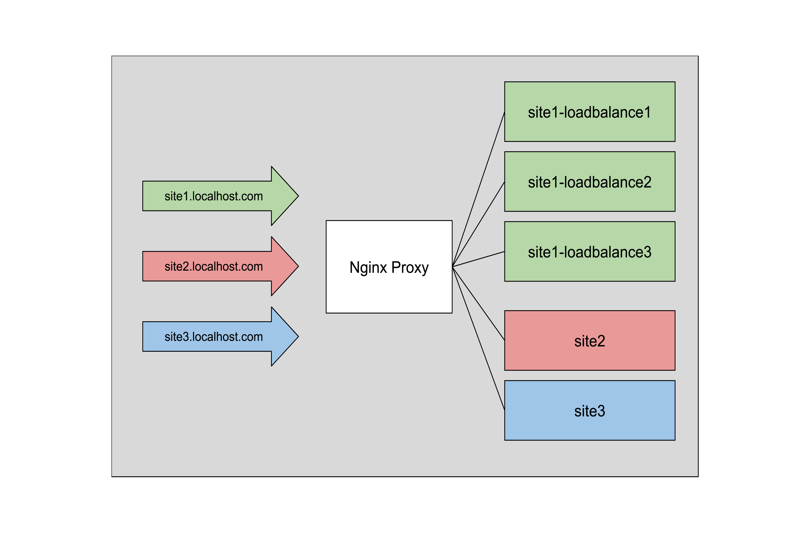
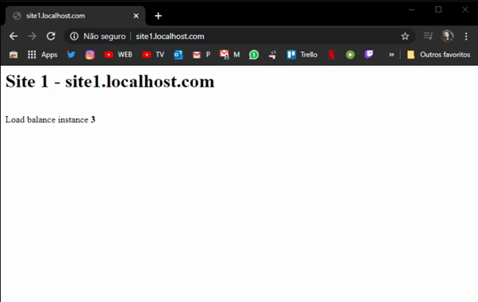

# Um modelo docker-compose de proxy reverso com Nginx, load balance e múltiplos domínios configurados
###### The ultimate easy example with one docker-compose template to nginx web server multiple domains and load balance

Projeto voltado a estudos sobre proxy reverso, load balance e configuração de múltiplos domínios 
com Nginx.

Esse arquivo do [docker compose](./docker-compose.yml) trás um modelo completo de sites 
configurados com load balance, chamados aqui de site1, tambem site2 e site3 para representar 
multiplos dominios no mesmo endereço IP.

(/docs/diagram.png)

Você deve apontar os endereços abaixo para o IP do host (caso esteja executando o docker em sua maquina, 
você deve apontar os endereços para seu localhost).

```
    127.0.0.1	    localhost
    ::1             localhost
    192.168.70.10   site3.localhost.com
    192.168.70.10   site2.localhost.com
    192.168.70.10   site1.localhost.com
``` 

Foi feita uma configuração minima, somente para demonstrar a funcionabilidade do load balance e 
configuração de multiplos dominios, qualquer aplicação real ou de mais opções, favor ler as referencias do projeto.

[](/docs/load-balance-exemple.gif)

### Change log

- 1.1
    - Adicionado PHP-FPM nas requisições
    - Adicionado encaminhamento de IP real do Proxy para o container


### Referências

- [Load Balancing with Nginx and Docker](https://www.sep.com/sep-blog/2017/02/28/load-balancing-nginx-docker/)
- [Brincando com Docker e Nginx: Multi Domínios e Proxy Reverso](https://stato.blog.br/wordpress/brincando-com-docker-e-nginx-multi-dominios-e-proxy-reverso/)
- [Use NGINX As A Reverse Proxy To Your Containerized Docker Applications](https://www.thepolyglotdeveloper.com/2017/03/nginx-reverse-proxy-containerized-docker-applications/)
- [Load Balance and Scale Node.js Containers with Nginx and Docker Swarm](https://levelup.gitconnected.com/load-balance-and-scale-node-js-containers-with-nginx-and-docker-swarm-9fc97c3cff81)
- [Forwarding Visitor’s Real-IP + Nginx Proxy/Fastcgi backend correctly](https://easyengine.io/tutorials/nginx/forwarding-visitors-real-ip/?amp)